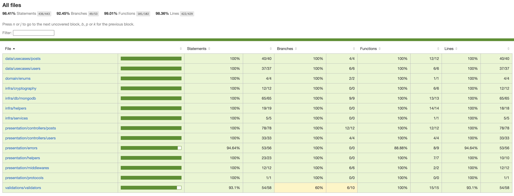

# Wall App Backend

API in Node.js with Typescript intended for use by [Wall App](https://github.com/priscilladeroode/wall_app_frontend).

## 📦 What's included?

### User

- Register user;
- Send a welcome e-mail;
- Authenticate;

### Posts

- Create a post;
- Get all posts;
- Get posts by user;
- Get a post by id;
- Update a post;
- Delete a post;

## :warning: Prerequisites

Ensure that `Node.js v.16.9.1` and `MongoDB v.5.0.4` are installed.

## 🚦 How to execute

- Clone the repository

`git clone https://github.com/priscilladeroode/wall_app_node.git`

- Open the project in your IDE (I recommend VSCode);

- Open the terminal in the project root;

- Install dependencies

  `npm install`

- Create a file `.env` in the root project and paste the following values:

```
SENDGRID_API_KEY = <your-sendgrid-api-key>
MONGO_URL = mongodb://localhost:27017/wall-app-backend
PORT = 5050
JWT_SECRET = <secret>
```

- Build the application

  `npm run build`

- Start the server

  `npm start`

## 🛂 Tests

- This project has a coverage of 98.41%

<h1 align="center">
  
</h1>
